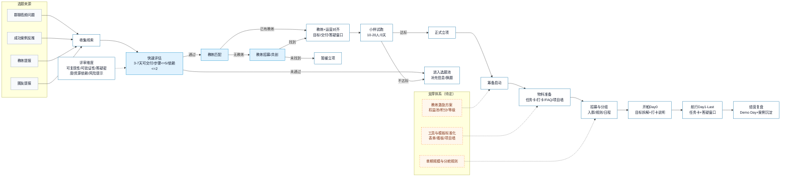

# Mini航海作战地图（3-7天冲刺版）

```mermaid
flowchart LR
  subgraph Sources["选题来源"]
    S1["群聊高频问题"]:::entry
    S2["成功案例反推"]:::entry
    S3["教练提报"]:::entry
    S4["圈友提报"]:::entry
  end

  Collect["收集线索"]:::action
  S1 --> Collect
  S2 --> Collect
  S3 --> Collect
  S4 --> Collect

  Collect --> E1["快速评估\n3-7天可交付/步骤<=5/依赖<=2"]:::decision
  Eval["评审维度\n可复现性/可验证性/答疑密度/资源依赖/风险提示"]:::action
  Eval -.-> E1

  E1 -->|通过| C1["教练匹配"]:::decision
  E1 -->|未通过| Pool["进入选题池\n补充信息/换题"]:::action

  C1 -->|已有教练| Align["教练+运营对齐\n目标/交付/答疑窗口"]:::action
  C1 -->|无教练| Recruit["教练招募/共创"]:::decision
  Recruit -->|找到| Align
  Recruit -->|未找到| Pause["暂缓立项"]:::action

  Align --> Pilot["小样试跑\n10-20人/3天"]:::action
  Pilot -->|达标| Approve["正式立项"]:::action
  Approve --> Prep["筹备启动"]:::action
  Pilot -->|不达标| Pool

  Prep --> Materials["物料准备\n任务卡/打卡/FAQ/项目墙"]:::action
  Materials --> Enroll["招募与分组\n入群/规则/日程"]:::action
  Enroll --> Day0["开船Day0\n目标拆解+打卡说明"]:::action
  Day0 --> Run["航行Day1-Last\n任务卡+答疑窗口"]:::action
  Run --> Close["结营复盘\nDemo Day+案例沉淀"]:::action

  subgraph Support["支撑体系（待定）"]
    U1["教练激励方案\n权益池/积分/等级"]:::pending
    U2["工具与模板标准化\n表单/看板/项目墙"]:::pending
    U3["单期规模与分舱规则"]:::pending
  end

  U1 -.-> Prep
  U2 -.-> Materials
  U3 -.-> Enroll

  classDef entry fill:#F8FAFC,stroke:#94A3B8,color:#0F172A;
  classDef decision fill:#E0F2FE,stroke:#0284C7,color:#0F172A;
  classDef action fill:#FFFFFF,stroke:#0369A1,color:#0F172A;
  classDef pending fill:#FFF7ED,stroke:#F97316,color:#7C2D12,stroke-dasharray: 4 4;
```
